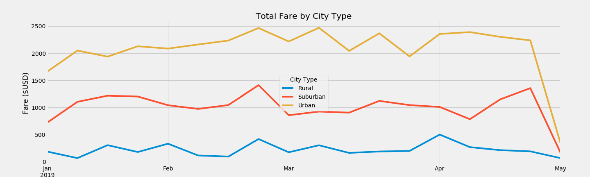

# PyBer_Analysis
The PyBer analysis was completed in order to deliver a clear and concise representation of the ride-sharing app data to the company CEO. The data was analyzed by organizing the fares per ride, and per driver into three different types of city. This allowed us to recognize different patterns of success in the ride-sharing app between different geographical areas. 

## Challenges
Luckily, the raw data used in this assignment was very clean, allowing me to go ahead with the analysis. A method I used to further organize the raw data was to merge the two separate dataframes: ride_data_df and city_data_df. This created my master dataframe, pyber_data_df, which I used to create my visual representations. The line graph below shows that the trends between the three city types mirror each other, and tend to be dependent on the time of year. This makes sense because as the weather gets better (in May, for example), people will walk more. This graph shows that there are more variables to be considered throughout this analysis other than city type.

### Further Research
After completing my summary dataframe, I observed that the urban city type has a much higher amount of total fares, which results in higher fares per ride and per driver in urban areas. Rural cities had the lowest fares, likely due to lower population density. I would suggest further analysis to determine whether offering the app in rural areas is financially sustainable for the company. To perform this analysis, I would request more data from the company pertaining to operation costs. I would compare the money spent for operating the application in the varying city types. 
